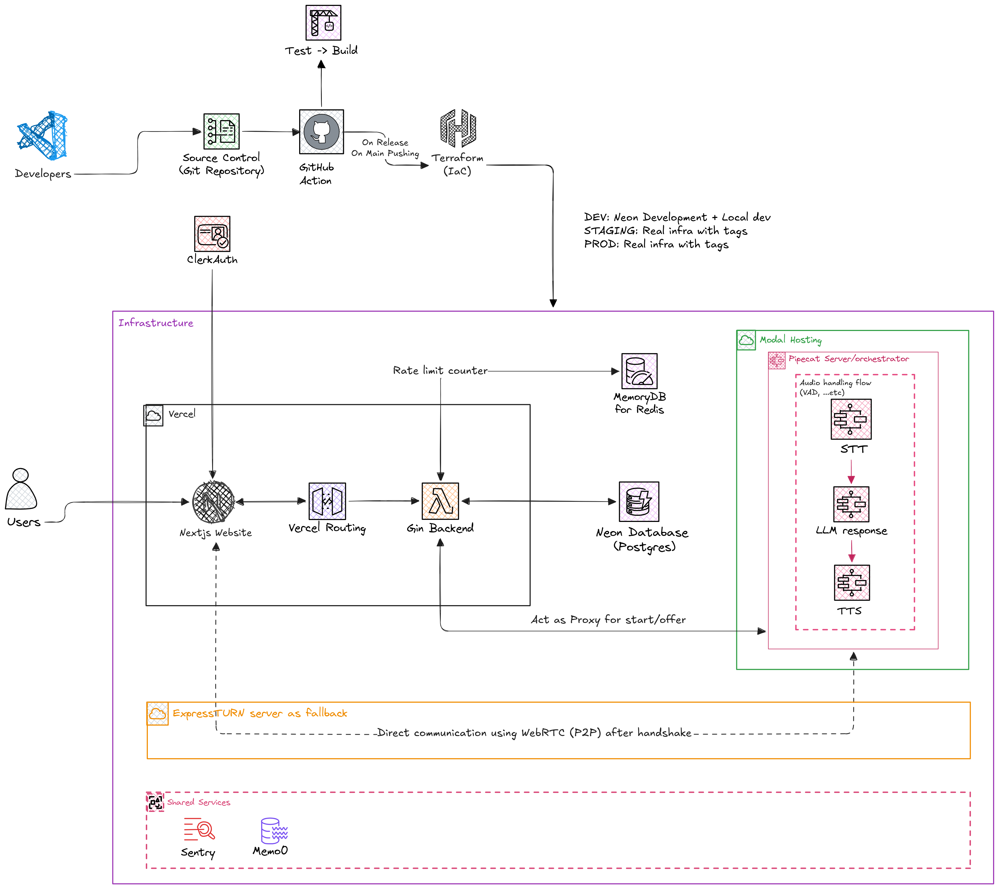
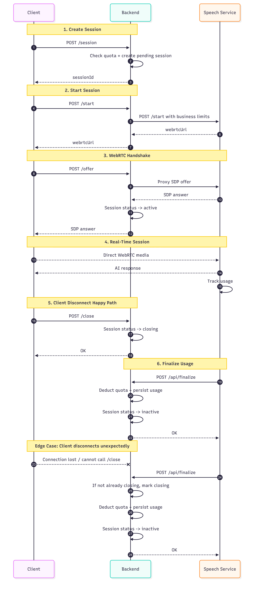

# 🎙️ Sona — AI Voice Companion

<p align="center" style="background-color: #ffffff;">
  
</p>

<p align="center">
  <strong>Speak naturally. Learn confidently.</strong>
</p>

<p align="center">
  
  
  
  
</p>

---

> **Sona is under active development.** Core MVP is complete — staging environment is live at [sona-go-api-staging.vercel.app](https://sona-go-api-staging.vercel.app). See [Progress](#-roadmap--progress) for what's done and what's next.

---

## Tech Stack

| Layer | Technology |
|-------|-----------|
| **Frontend** | Next.js 16 (App Router), TypeScript, Tailwind CSS v4, shadcn/ui |
| **Auth** | Clerk |
| **Voice Client** | Pipecat AI Client JS + React + SmallWebRTC Transport |
| **API Backend** | Go, Gin, GORM, pgx |
| **Speech Pipeline** | Python, Pipecat AI, FastAPI |
| **STT** | Deepgram |
| **LLM** | OpenAI-compatible API (Deepseek via OpenCode proxy) |
| **TTS** | Piper (local model) |
| **Memory** | Mem0 with pgvector extension |
| **Database** | Neon PostgreSQL |
| **Cache** | Upstash Redis |
| **Observability** | Sentry, Zap |
| **Infrastructure** | Terraform (Neon, Upstash, Sentry, Vercel providers) |
| **CI/CD** | GitHub Actions |
| **Deployment** | Vercel (web + API), Modal (speech engine) |


---


## Why Sona?

I wanted to improve my English speaking skills. I tried existing AI voice tutors — they're either paywalled, or can't be customized to my needs. So I built my own.

Sona is an end-to-end **AI voice companion platform** that combines **speech-to-text**, a **large language model**, and **text-to-speech** into a WebRTC pipeline. It remembers conversation context across sessions via long-term memory.

**Current persona:** English speaking teacher.

---

## Key Features

| Feature | Description |
|---------|-------------|
| **Real-time voice chat** | Response pipeline: Deepgram STT → LLM → Piper TTS over WebRTC |
| **Persistent memory** | Mem0 + pgvector remembers conversation context across sessions |
| **User authentication** | Clerk provides sign-up, sign-in, and session management |
| **Session management** | Create, start, and review past voice sessions with full message history |
| **Rate limiting & quotas** | Configurable per-user rate limits and session duration caps |
| **Observability** | Sentry error tracking across all services along with structured logging |
| **Infrastructure as code** | Terraform modules for Neon, Redis, Sentry, and Vercel |

---

## Architecture Overview

<div align="center">
  
  <p><em>Figure 1. Infrastructure Architecture</em></p>
</div>

### Session Lifecycle

<div align="center">
  
  <p><em>Figure 2. Session Lifecycle</em></p>
</div>


---

## Project Structure

```
sona-voice/
├── web/                          # Next.js frontend
│   ├── src/
│   │   ├── app/                  # App Router pages
│   │   │   ├── (auth)/           # Sign-in / sign-up
│   │   │   ├── (main)/           # Main app (chat, sessions, landing)
│   │   │   └── api/proxy/webrtc/ # WebRTC proxy to backend for client side
│   │   ├── components/           # Shared UI components
│   │   │   ├── common/           # AnalysisCard, LoadingScreen, Logo, etc.
│   │   │   └── ui/               # shadcn/ui primitives
│   │   ├── features/             # Feature modules
│   │   │   ├── chat-interface/   # VoiceOrb, VoicePanel, VoiceToolbar, etc.
│   │   │   ├── landing/          # LandingHero, ConnectNow
│   │   │   └── session-history/  # SessionMessageList, services
│   │   ├── hooks/                # Custom React hooks
│   │   ├── lib/                  # API client, types, utilities
│   │   └── instrumentation.ts    # Sentry setup
│   ├── package.json
│   └── next.config.ts
│
├── services/
│   ├── api/                      # Go API backend
│   │   ├── cmd/server/           # Entry point + Swagger docs
│   │   ├── internal/
│   │   │   ├── configs/          # Typed config (DB, Clerk, Redis, Sentry)
│   │   │   ├── core/             # Enums, errors, response envelope, logger
│   │   │   ├── database/         # GORM models, migrations, repos
│   │   │   ├── middlewares/      # Auth, role, rate limiter
│   │   │   ├── modules/
│   │   │   │   ├── session/      # Session CRUD + WebRTC orchestration
│   │   │   │   └── message/      # Message persistence
│   │   │   └── utils/            # Helpers
│   │   ├── go.mod
│   │   └── vercel.json
│   │
│   └── speech-engine/            # Python voice pipeline
│       ├── src/
│       │   ├── agents/           # System prompts + tools
│       │   ├── core/             # Pydantic config
│       │   ├── pipelines/        # STT/LLM/TTS factories, tasks, handlers
│       │   ├── services/         # API clients to Go backend
│       │   ├── types/            # Message types
│       │   └── utils/            # Error helpers
│       ├── main.py               # Bot entry point (Pipecat pipeline)
│       ├── runner.py              # Custom FastAPI WebRTC runner
│       ├── modal_app.py           # Modal serverless deployment
│       ├── requirements.txt
│       └── pyproject.toml
│
├── infrastructure/               # Terraform IaC
│   ├── modules/                  # Reusable modules
│   └── environments/             # Per-environment configs
│
└── .github/workflows/            # CI/CD pipelines
```
---

## Installation

### Prerequisites

| Tool | Version | Purpose |
|------|---------|---------|
| [Go](https://go.dev/dl/) | >= 1.25 | API backend |
| [Python](https://www.python.org/downloads/) | >= 3.12 | Speech engine |
| [Node.js](https://nodejs.org/) | >= 20 | Web frontend |
| [PostgreSQL](https://www.postgresql.org/) | 15+ | Database (with pgvector extension) |
| [Redis](https://redis.io/) | 7+ | Caching & rate limiting |

---

## Environment Variables

Each service has a `.env.example` file with a template of all required and optional variables. Copy it to `.env` and fill in the values:

| Service | Template |
|---------|----------|
| Web | `web/.env.example` |
| API | `services/api/.env.example` |
| Speech Engine | `services/speech-engine/.env.example` |

---

## Running Locally

### 1. Configure environment

Copy `.env.example` to `.env` in each service folder and fill in the required values:

```bash
cp services/api/.env.example services/api/.env
cp services/speech-engine/.env.example services/speech-engine/.env
cp web/.env.example web/.env
```

### 2. Install dependencies

```bash
make install
```

This installs npm packages for the web frontend, downloads Go modules for the API, and installs Python dependencies for the speech engine.

### 3. Start services

```bash
make dev
```

This starts the speech engine, Go API, and Next.js frontend in parallel. Open [http://localhost:3000](http://localhost:3000) in your browser.

You can also start individual services:

```bash
# Speech engine (port 7860)
make speech

# Go API (port 8080)
make api

# Next.js frontend (port 3000)
make web
```

### 4. Local database & Redis

A PostgreSQL container is provided for local development:

```bash
cd services/api/docker
docker compose up -d
```

---

## Deployment

### Infrastructure (Terraform)

Sona uses Terraform to manage infrastructure across environments:

```
infrastructure/
├── modules/
│   ├── database/    # Neon PostgreSQL (with pgvector)
│   ├── redis/       # Upstash Redis
│   ├── sentry/      # Sentry projects + DSNs
│   └── vercel/      # Vercel project + env vars
└── environments/
    ├── shared/      # Cross-environment resources (Redis)
    ├── dev/         # Development
    └── staging/     # Staging (auto-deployed from main)
```

```bash
cd infrastructure/environments/staging
terraform init
terraform plan
terraform apply
```

### Services

| Service | Platform | Notes |
|---------|----------|-------|
| Web frontend | **Vercel** | Next.js with Edge runtime |
| Go API | **Vercel** | Go runtime via `vercel.json` |
| Speech engine | **Modal** | CPU serverless containers |

### CI/CD

GitHub Actions handles:

- **PR checks** (`ci-workflow.yaml`): lint, build, and test all three services
- **Staging deploy** (`deploy-staging.yaml`): on merge to `main` — runs Terraform apply, syncs secrets to Modal, deploys the speech engine, and syncs env vars to Vercel

---

## Roadmap / Progress

### Completed

* [x] Real-time voice pipeline (STT → LLM → TTS over WebRTC)
* [x] User authentication (Clerk)
* [x] Session CRUD + message history
* [x] Mem0 long-term memory with pgvector
* [x] Rate limiting & user quotas
* [x] Sentry error tracking (all services)
* [x] Zap structured logging (API)
* [x] Terraform IaC (dev + staging)
* [x] CI/CD with auto-deploy to staging
* [x] Modal serverless deployment (speech engine)
* [x] Vercel deployment (web + API)
* [x] Unit tests for API backend

### In Progress / Planned

* [ ] Reduce end-to-end voice latency
* [ ] Production Terraform environment
* [ ] Frontend test suite
* [ ] Speech engine test suite
* [ ] E2E / integration tests
* [ ] Pronunciation feedback & scoring
* [ ] Speaking fluency analysis
* [ ] Vocabulary suggestions after conversation
* [ ] Grammar correction & explanation
* [ ] Personalized speaking recommendations
* [ ] Conversation summary + learning insights
* [ ] Adaptive difficulty by learner level
* [ ] Custom AI tutor personas
* [ ] Multi-language support
* [ ] Admin dashboard
